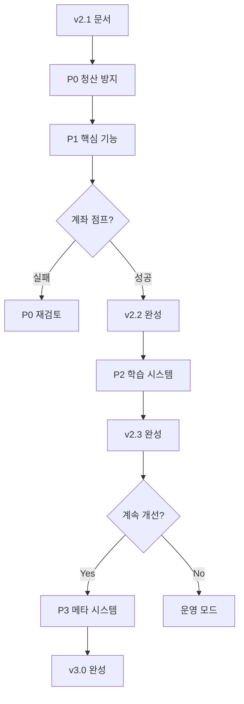

# Implementation Roadmap — CBGB v2.1 → v3.0

## 문서 개요

이 문서는 CBGB (Controlled BTC Growth Bot) 구현의 전체 로드맵입니다.

**현재 상태**: v2.1 (문서 완성)
**목표**: v3.0 (자기 진단 시스템)

---

## 전체 구조

```
v2.1 (현재)
  │
  ├─ P0: 청산 방지 (100% 필수)
  │   └─ 완료 → v2.2-P0
  │
  ├─ P1: 핵심 기능 (90% 필수)
  │   └─ 완료 → v2.2 (실거래 가능)
  │
  ├─ P2: 학습 시스템 (80% 권장)
  │   └─ 완료 → v2.3 (적응형 시스템)
  │
  └─ P3: 메타 시스템 (선택)
      └─ 완료 → v3.0 (자기 진단)
```

---

## Phase Dependency



---

## 1. P0: Critical Fixes (청산 방지) — 1주차

### 목표
**이것들이 없으면 계좌가 청산됩니다.**

### 작업 항목
1. **Expansion 청산 DD 시뮬레이션**
   - LiquidationPathSimulator 구현
   - Monte Carlo 1000회 시뮬레이션
   - 95th percentile DD > -50% → expansion 차단

2. **Liquidation Monitor 연결**
   - LiquidationMonitor 클래스
   - 청산가 거리 < 1.5 ATR → LIQUIDATION_WARNING

3. **Emergency Exit 로직**
   - EmergencyExit 클래스
   - Market Order 즉시 청산

4. **Position Size 청산가 계산**
   - PositionSizer에 청산가 검증
   - 진입 전 청산가 거리 < 3 ATR → 차단

5. **Drawdown -50% 강제 종료**
   - DrawdownMonitor 클래스
   - DD -50% → TERMINATED

### 완료 기준
- [ ] 레버리지 > 5x 진입 시도 → 차단
- [ ] 청산가 < 3 ATR 진입 시도 → 차단
- [ ] 포지션 보유 중 청산가 < 1.5 ATR → 자동 청산
- [ ] DD -50% 도달 → TERMINATED

### 예상 일정
**1주차 (7일)**

### 다음 단계
P0 100% 완료 → P1 시작

**문서**: [P0_critical_fixes.md](P0_critical_fixes.md)

---

## 2. P1: Core Completion (핵심 기능) — 2~3주차

### 목표
**이것들이 없으면 수익이 발생하지 않습니다.**

### 작업 항목
1. **EV Framework Cold Start**
   - 초기 10 트레이드: +255% 고정 임계값 (0.85 multiplier)
   - EVDecisionLog에 cold_start 플래그

2. **DecisionOutcome opportunity_cost**
   - OpportunityCost 계산 로직
   - DecisionEvaluator 클래스
   - 자동 평가 스케줄러 (매일)

3. **학습 루프 자동화**
   - ThresholdAdjuster 클래스
   - missed_opportunity 3회 → 임계값 -5%
   - good_denial 5연속 → 임계값 +10%

4. **Strategy 방향성 필터**
   - FeatureEngine (EMA200, ATR 계산)
   - DirectionalFilter (price > EMA200)

5. **State Machine 기본 흐름**
   - StateMachine 클래스
   - 9×9 전환 테이블 구현
   - TradingOrchestrator 메인 루프

### 완료 기준
- [ ] 첫 10개 트레이드: +255% 임계값
- [ ] 거절 7일 후 counterfactual R 계산
- [ ] DecisionOutcome → 임계값 자동 조정
- [ ] price < EMA200 → TradeIntent 생성 안 됨
- [ ] IDLE → MONITORING → ENTRY 흐름 작동

### 예상 일정
**2~3주차 (14일)**

### 다음 단계
P1 90% 완료 → v2.2 릴리스 → Paper Trading 2주

**문서**: [P1_core_completion.md](P1_core_completion.md)

---

## 3. v2.2 검증 (Paper Trading) — 4~5주차

### 목표
**실거래 전 최종 검증**

### 작업 항목
1. **Paper Trading 2주**
   - Bybit Testnet 연결
   - 실시간 데이터로 신호 생성
   - 모든 로그 기록

2. **로그 분석**
   - EV 통과/차단 로그 (최소 10개)
   - State 전환 로그
   - DecisionOutcome 수집 (최소 5개)

3. **성능 검증**
   - +300% 트레이드 1회 이상 발생
   - 청산 경고 0회
   - DD < -30%

### 완료 기준
- [ ] Paper Trading 2주 완료
- [ ] +300% 트레이드 1회 이상
- [ ] 청산 경고 0회
- [ ] EV 차단 로그 명확

### 의사결정 기준
- **통과**: P2 시작
- **실패**: P0/P1 재검토

### 예상 일정
**4~5주차 (14일)**

---

## 4. P2: Learning System (학습 시스템) — 6~8주차

### 목표
**시스템이 스스로 개선합니다.**

### 작업 항목
1. **State Machine Meta-Capability**
   - StateHealthMonitor 클래스
   - Duration anomaly, Failure streak, Oscillation 감지
   - 비정상 시 COOLDOWN 전환

2. **Regime-Aware EV Adjustment**
   - RegimeDetector (ATR 변화율 기반)
   - CONTRACTION → 임계값 0.7x 완화

3. **Feature Engine 캐싱**
   - FeatureCache (TTL 5분)
   - 캐시 히트 시 < 10ms

4. **Slippage 동적 임계값**
   - SlippageEstimator (ATR 기반)
   - 변동성 높을 때 넉넉한 허용

5. **Tail Profit 분포 분석**
   - TailAnalyzer (상위 10% 패턴)
   - 월간 보고서 생성

### 완료 기준
- [ ] ENTRY_PENDING 2시간 → MONITORING
- [ ] EXIT_FAILURE 5연속 → COOLDOWN
- [ ] ATR 증가 > 20% → EXPANSION 감지
- [ ] Feature 계산 < 10ms (캐싱)
- [ ] Tail 분석 보고서 생성

### 예상 일정
**6~8주차 (21일)**

### 다음 단계
P2 80% 완료 → v2.3 릴리스

**문서**: [P2_learning_system.md](P2_learning_system.md)

---

## 5. v2.3 검증 (1개월 Paper Trading) — 9~12주차

### 목표
**학습 능력 검증**

### 작업 항목
1. **1개월 Paper Trading**
   - 자동 조정 로그 확인
   - Regime 전환 확인
   - Health issue 감지 확인

2. **학습 로그 분석**
   - ThresholdAdjustment 로그 (최소 4회)
   - RegimeDetector 로그
   - StateHealth 이슈 (최소 1회)

3. **성능 평가**
   - DecisionOutcome 100개 이상
   - Tail 분석 완료
   - 계좌 성장 확인

### 완료 기준
- [ ] 1개월 Paper Trading 완료
- [ ] Regime 전환 → 임계값 조정 확인
- [ ] Health issue 감지 및 대응 확인
- [ ] DecisionOutcome 100개 이상

### 의사결정 기준
- **계좌 점프 성공** (2~3배): P3 고려
- **계좌 점프 실패**: 전략 재검토

### 예상 일정
**9~12주차 (28일)**

---

## 6. P3: Meta System (메타 시스템) — 선택 사항

### 목표
**시스템이 스스로를 판단합니다.**

### 작업 항목
1. **Strategy Validity Assessment**
   - StrategyEvaluator
   - 20 트레이드마다 유효성 평가

2. **Self-Adjusting Thresholds**
   - AdaptiveAdjuster (regime-aware 조정폭)

3. **Position Sizing Learning**
   - DynamicSizer (계좌 규모 기반)

4. **Multi-Strategy Portfolio**
   - StrategyRegistry (설계만)

5. **Drawdown Recovery Mode**
   - RecoveryMode (DD 구간별 대응)

### 완료 기준
- [ ] 평균 R < 0 → TERMINATED
- [ ] DD -30% → 사이즈 50%
- [ ] equity 1000 → risk 3%

### 예상 일정
**2~3개월 (계좌 점프 후)**

**문서**: [P3_meta_system.md](P3_meta_system.md)

---

## 전체 타임라인 요약

| Phase | 기간 | 누적 | 목표 | 산출물 |
|-------|------|------|------|--------|
| P0 | 1주 | 1주 | 청산 방지 | v2.2-P0 |
| P1 | 2주 | 3주 | 핵심 기능 | v2.2-P1 |
| v2.2 검증 | 2주 | 5주 | Paper Trading | v2.2 릴리스 |
| P2 | 3주 | 8주 | 학습 시스템 | v2.3 |
| v2.3 검증 | 4주 | 12주 | 1개월 Paper | v2.3 릴리스 |
| **계좌 점프 판정** | - | - | 2~3배 성장 | - |
| P3 | 2~3개월 | 5~6개월 | 메타 시스템 | v3.0 |

---

## 우선순위 원칙

### 절대 규칙
1. **P0 없으면 실거래 금지**
2. **P1 없으면 수익 불가**
3. **계좌 점프 전까지 P3 금지**

### 품질 기준
- P0: 100% (청산 = 실패)
- P1: 90% (핵심 동작)
- P2: 80% (학습 능력)
- P3: 선택 (메타 능력)

### 의사결정 기준
```
v2.2 Paper Trading 2주 후:
├─ 청산 0회 + +300% 1회 → P2 진행
└─ 청산 1회 이상 → P0 재검토

v2.3 Paper Trading 1개월 후:
├─ 계좌 2~3배 → P3 고려
├─ 계좌 1.5~2배 → v2.3 운영
└─ 계좌 < 1.5배 → 전략 재검토
```

---

## 구현 체크리스트

### v2.2 (P0 + P1) 완료 조건
- [ ] P0 5개 항목 100% 완료
- [ ] P1 5개 항목 90% 완료
- [ ] Paper Trading 2주 완료
- [ ] +300% 트레이드 1회 이상
- [ ] 청산 경고 0회

### v2.3 (P2) 완료 조건
- [ ] P2 5개 항목 80% 완료
- [ ] Paper Trading 1개월 완료
- [ ] DecisionOutcome 100개 이상
- [ ] Regime 전환 확인
- [ ] Health issue 감지 1회 이상

### v3.0 (P3) 완료 조건
- [ ] 계좌 점프 확인 (2~3배)
- [ ] P3 5개 항목 선택 구현
- [ ] 6개월 운영 로그

---

## 현재 위치

```
[v2.1 문서 완성] ← 여기
  │
  ├─ 다음: P0 구현 (1주)
  ├─ 목표: v2.2 릴리스 (5주 후)
  └─ 최종: 계좌 점프 (3개월 후)
```

---

## 관련 문서

- [P0_critical_fixes.md](P0_critical_fixes.md) - 청산 방지
- [P1_core_completion.md](P1_core_completion.md) - 핵심 기능
- [P2_learning_system.md](P2_learning_system.md) - 학습 시스템
- [P3_meta_system.md](P3_meta_system.md) - 메타 시스템

---

## 마지막 원칙

이 로드맵은 **계획이 아니라 지도**입니다.

> **계좌가 점프하지 않으면,**
> **P3가 아니라 P0로 돌아갑니다.**

Account Builder의 성공 기준은 하나입니다:
**작은 계좌가 다음 단계로 이동했는가?**
